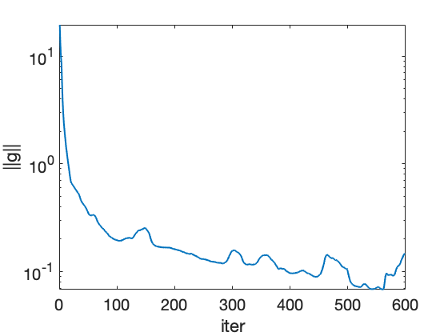

# Performance of Each Optimizers 

## Introduction

In this report, I explore the performance of four optimization algorithms for minimizing the loss function and finding the optimal dividing quadratic hypersurface for the MNIST dataset for classification problem. The chosen optimizers are:

	1. Stochastic Inexact Newton (SIN) 
	2. Levenberg-Marquardt 
	3. Stochastic Gradient Descent (SGD)
	4. Stochastic Nesterov
	5. Stochastic Adam

## Experimental Setup

I conducted experiments for each solver, experimenting with appropriate settings for convergence. For the following stochastic optimizers (SIN, SGD, Nesterov, Adam), we ensured consistency by running them for the same number of epochs. The size of one epoch is defined as **rounding the number of training data points divided by the number of batches**.

## Optimizer Configurations

### Stochastic Inexact Newton (SIN)

- This optimizer is given from the problem.

### Levenberg-Marquardt

	- Max trust-region radius: 1
	- Min trust-region radius: 1e-14
	- Initial radius: 0.2
	- Step rejection parameter: 0.01
	- Max # of iterations for subproblems: 5
	- Relative tolerance for subproblems: 0.1

### Stochastic Gradient Descent (SGD)

	- Learning rate: 0.9
	- Penalty parameter (lambda): 0.001

### Stochastic Nesterov

	- Learning rate: 0.9
	- Penalty parameter (lambda): 0.001

### Stochastic Adam

	- Learning rate: 0.9
	- Penalty parameter (lambda): 0.001
	- Exponential decay rates (B1): 0.9
	- Exponential decay rates (B2): 0.999

## Results

The following presents the results for each optimizer, including estimates for the loss function and the norm of its gradient. Note that only SIN is able to display the hyperplane because the number of PCAs is set to 3. For the others, the number of PCAs is set to 20.

### Stochastic Inexact Newton (SIN)

 
 

### Levenberg-Marquardt

 

### Stochastic Gradient Descent (SGD)

 

### Stochastic Nesterov

 

### Stochastic Adam

 

## Performance Comparison

Compare the performance of the optimizers in terms of convergence speed and accuracy. 

| Optimizer               | Norm       | Iterations Count | Accuracy   |
|-------------------------|------------|------------------|------------|
| SIN				      | 8.301e-02  | 10000 (max)      | 96.9%      |
| Levenberg-Marquardt     | 9.987e-04  | 55            	  | 99.5%      |
| SGD					  | 1.996e-01  | 600 (max)        | 97.9%      |
| Stochastic Nesterov     | 3.200e-01  | 600 (max)        | 99.1%      |
| Stochastic Adam         | 1.167e-01  | 600 (max)        | 98.2%      |

## Efficiency Analysis

The Levenberg-Marquardt algorithm is the most efficient one, which only takes less than 100 iterations. For the three stochastic methods (SGD, Nesterov, Adam), the norms converge to 1e-01 relatively fast. However, they start to converge slower at that point.

## Conclusion

Based on the simulations, the Levenberg-Marquardt and the Stochastic Nesterov algorithms both have great accuracy. However, the Levenberg-Marquardt is the better one, since it took less to converge.

---
